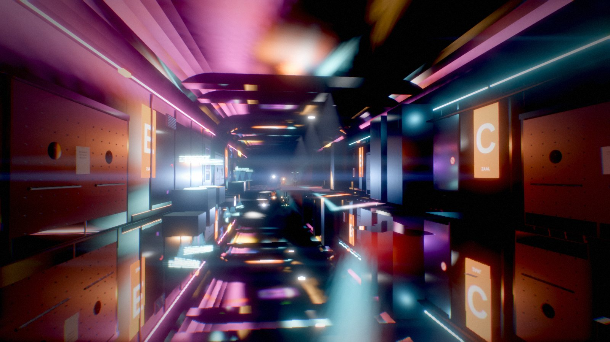
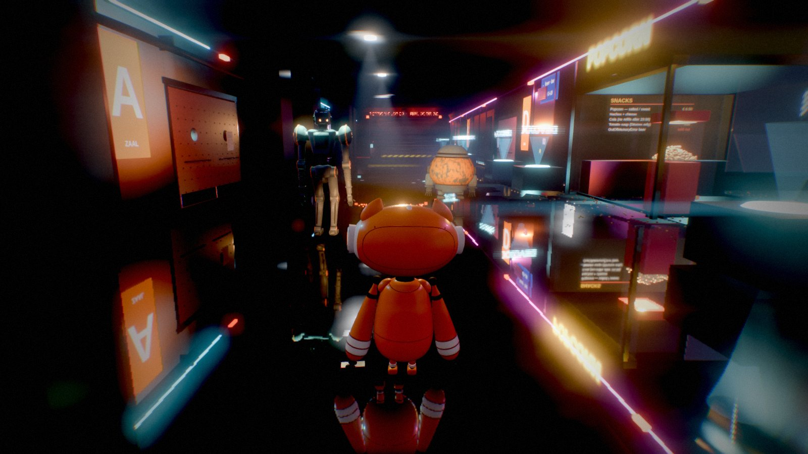
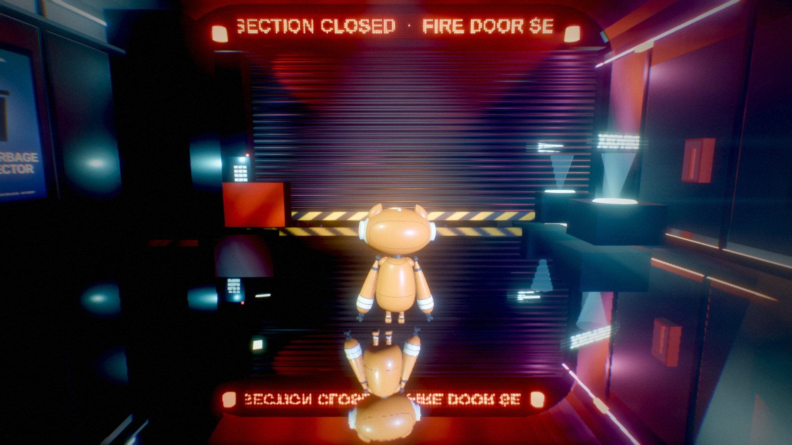
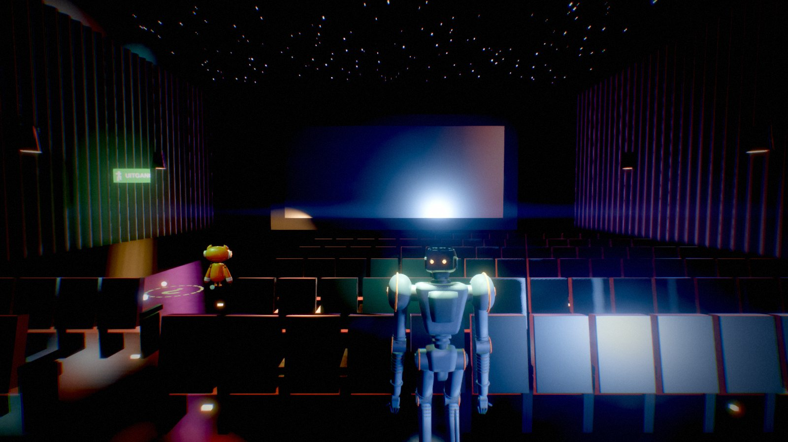
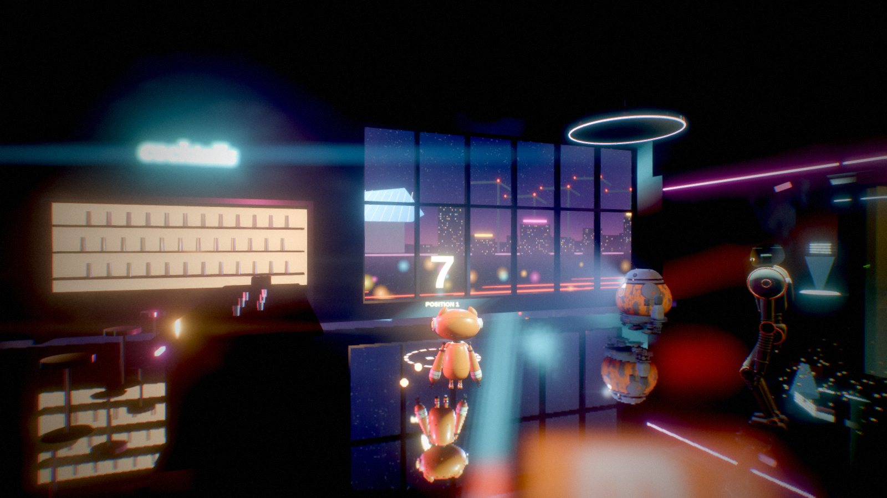
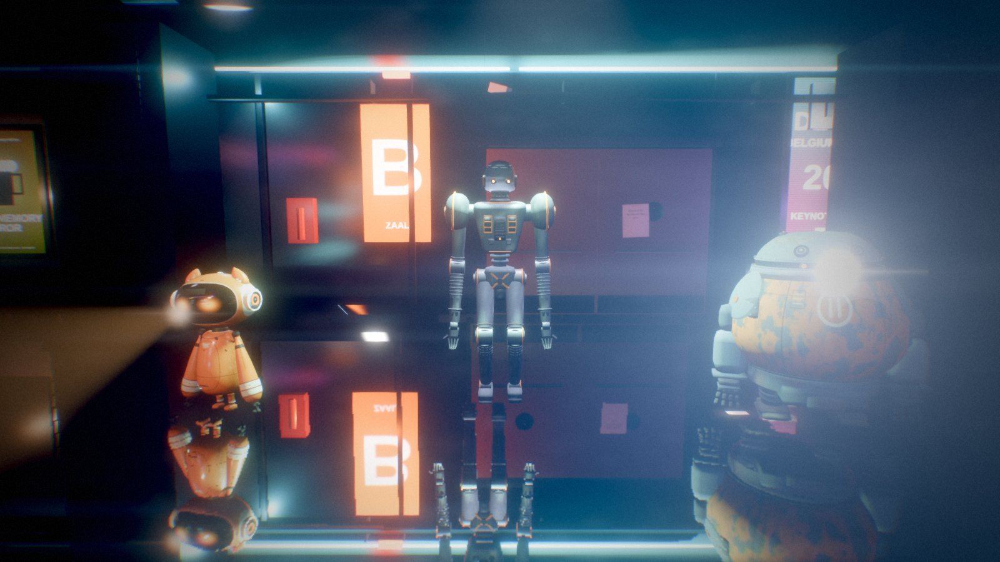

# After Dark 3D — the full-3D proof of concept (branch `claude/blissful-pascal-vh7byc`)

Michele, 23 Sep 2026: *"on main we are working on the 2.5d version of the game. Can you make a quick
POC of a full 3D version? Starting from chapter 1, or part of it. Use your own branch, fork for main,
don't care on subsequent changes there. The aim is to get to a graphic level on par with Cyberpunk
2077. Loop until you get there, compare the result with screenshots from the game and go on!"*

## Run it

```bash
pnpm install
pnpm dev                 # then open http://localhost:5173/3d.html
```

`pnpm build` builds both pages; the 3D one is `dist/3d.html`.

Controls: **WASD / arrows** move, relative to the camera · **mouse** looks (click to lock the
pointer, or drag) · **wheel** zooms · **1/2/3/Tab** switch robot · **E** use / climb · **Space** tow
Biggy · **4–9** at the keypad · **P** photo mode (hides the HUD, depth of field on the driven robot)
· **Q** cycles render quality
(low → medium → high → ultra; remembered) · **M** mute.

Debug URL: `?q=low|medium|high|ultra`, `?seed=N`, `?warm=N`, `?nohud=1`, `?shot=1` (no animation
loop; `window.__ad3d.step(n)` drives frames — this is how every screenshot below was taken).

## Screenshots

Rendered by the headless harness (software WebGL, 1600x900, quality "high"), HUD off.

| | |
|---|---|
|  |  |
|  |  |
|  |  |

## What it is

The same headless sim, HUD and audio as the 2.5D build — **nothing in `src/sim` was touched** — and a
second renderer, `src/render3d/`, entered from `3d.html` / `src/main3d.ts`:

| file | what it does |
|---|---|
| `world.ts` | the seam with the sim: renderer, pipeline, venue, robots, props, camera; reads a `GameSnapshot` each frame |
| `pipeline.ts`, `shaders.ts` | the HDR frame: planar reflection → scene (MSAA, depth) → GTAO → raymarched volumetric fog through each spot light's **own shadow map**, temporally accumulated → bloom mip chain (Jimenez 2014) + anamorphic streak + lens dirt → AgX, split-tone grade, CA, vignette, grain → FXAA |
| `reflector.ts` | the polished floor's mirror image (oblique-clipped mirror camera, blurred copy for rough spots) |
| `textures.ts` | every surface texture baked on the GPU from shaders at load (terrazzo, carpet, plaster, acoustic fabric, steel, enamel, velvet, ceiling, counter, lens dirt) — no image files |
| `materials.ts` | the PBR library, world-metric UVs, world-space grime, the reflection patch |
| `venue.ts` | the closed section at full height **from `floor1Walls()`** — corridor with coved vault, cinemas A–E (screens, velvet seats, drapes, star ceilings, sconces), foyer with bar and windows onto Antwerp, glass kiosk, fire shutter with beacons and an LED ticker, Zaal panels, posters, holo plinths |
| `props3d.ts` | what moves: the shutter rolls up, the jammed door falls on the sim's own clock with sparks, doors, keypad LCD, projector panel, clues (floor stencil, per-colour LEDs from `clueLitBy`, a floating digit once found) |
| `robots3d.ts` | the 2.5D rigs (same builders, same gait) with physical materials, and each lamp as a real shadow-casting SpotLight |
| `camera3d.ts` | third-person orbit with wall collision; WASD made camera-relative |
| `signs.ts`, `screens.ts` | canvas-drawn signage, posters, the city, an animated ad and a dot-matrix ticker |
| `hudTheme.ts` | a night-city skin over the shared HUD (its DOM and logic unchanged) |
| `details.ts` | wall furniture and floor clutter: lacquered panels, stickers and UV-reactive tags, extinguishers, CCTV, a cable tray, vents, popcorn, tickets, cola spills that mirror the room |
| `boxproj.ts` | box-projected (parallax-corrected) reflections from the corridor's cube capture, so reflected neon lands where the neon is |
| `lightpool.ts` | 28 venue point lights served by 14 real ones, nearest the camera, faded by distance |
| `merge.ts` | static meshes merged per material; robot rigs merged per bone so the gait still drives them |

It plays chapter 1 end to end — the clues, the keypad, Biggy through the jammed door — because the
sim does. It opens on a title over a slow dolly down the corridor (the sim waits until a key is
pressed). The build runs past the fire door to both secondary staircases (10|9 and 3|4, where the
plans put them), and the Devoxx half beyond has its lights on and its navy carpet, so the fire door
rolls up onto light. When the sim moves on to chapter 2, an end card says so.

**Performance.** Per frame: a planar reflection pass, up to five shadow maps, a GTAO normal pass, the
main pass, then the post chain. After the merge and light-pool passes that is ~1800 draw calls (from
~3600) and 17 real point lights (from 31) at 1280x720 "high". Adaptive resolution steps the pixel
ratio down on a slow machine; **Q** cycles quality.

## What was measured against what

The reference screenshots could not be fetched: this container's egress policy denies every image
host tried (`www.nvidia.com`, `store.steampowered.com` and the Steam CDNs, `upload.wikimedia.org`,
`images.igdb.com`). The comparison bar was therefore a written checklist of Cyberpunk 2077's night
look — deep blacks with saturated coloured light, wet reflective floors doubling every neon, haze
with visible shafts, bloom and lens artefacts, animated signage, dense surface detail, a
yellow/cyan/coral UI — and each round was a screenshot set (corridor, foyer, cinema E, fire door)
judged against it. Access was allowed on 24 Sep, but the change had not reached the running
container; a fresh session should be able to fetch them.

## Where it stands against that bar

Close on: the lighting language (coloured practicals, visible beams, reflections, bloom, grade),
signage and screens, the cinema interiors. Still clearly short on: **surface detail density** (walls
and props are mostly bevel-less boxes, with some decals, clutter and cables), **indirect light**
(a hemisphere and an environment capture stand in for bounce), and **character
detail** (the robots are the sheets' clean primitives). No browser renderer gets to Cyberpunk's
path-traced Overdrive mode; the honest target is its rasterised look, and the gap there is mostly
content, not pipeline.

## Deliberate deviations (decide tomorrow)

- **The closed section's floor is polished terrazzo**, not the Devoxx half's navy carpet: there is no
  photograph of the closed section, and the reflections carry most of the look. Cinemas keep carpet.
- **The foyer's west wall is glazed** onto a night view of Antwerp (cathedral spire, the Port House
  and MAS on the Eilandje, port cranes, the Ring). Invented, for sense of place.
- **Emergency power**: cove LED lines, a few downlights, signage and holograms are on although the
  chapter says the power is out. The house lights are off; the rule the puzzle needs (clues only
  under the robots' lamps) is untouched, since the sim decides it.
- **Droid's pool light** is drawn from 1.4 m above his head (a lamp just over his shoulders bleached
  him white); the pool on the floor keeps the sim's radius.

## Known gaps

- Until 24 Sep every procedural material rendered with black albedo (see `docs/genai-notes.md`).
  The look was re-graded after the fix, but lights placed during the black-albedo night may still
  be hotter than they need to be.

- Chapter 1 only; the walk-out cutscene ends at the top of the 3|4 staircase and cuts to the card.
- Performance is untested on real GPUs (developed on a software renderer, ~10 s a frame at
  1280x720 "high"). Adaptive resolution steps the pixel ratio down on a slow machine; **Q** drops
  quality. Keyboard + mouse only.
- Seven sim tests fail on this branch; they fail identically on the 2.5D branch it was forked from
  (chapter 2 was mid-change there) and this work did not touch `src/sim`.
